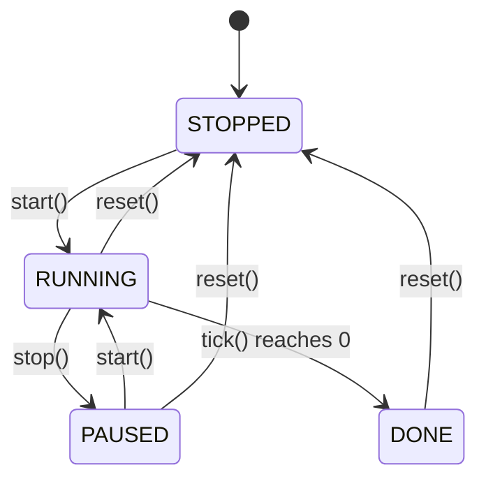

# Design Document — To-Do Life Dashboard

## Overview

The To-Do Life Dashboard is a single-page web application delivered as three static files:

```
index.html
css/style.css
js/app.js
```

There is no build step, no bundler, and no server-side component. All logic runs in the browser; all persistence uses `window.localStorage`. The application is structured as a collection of self-contained **modules** that share a thin **Storage layer** and a minimal **App controller** that wires them together on `DOMContentLoaded`.

### Design Goals

- **Zero dependencies** — vanilla HTML/CSS/JS only.
- **Module isolation** — each module owns its DOM subtree, its storage keys, and its internal state. Modules communicate only through the Storage layer or explicit function calls from the App controller.
- **Graceful degradation** — if LocalStorage is unavailable or data is corrupt, the app continues to function in a degraded (non-persistent) mode with a visible warning.
- **Cross-browser compatibility** — Chrome, Firefox, Edge, Safari (modern versions).
- **Responsive** — 320 px to 2560 px viewport width, no horizontal scroll.

---

## Architecture

### High-Level Component Diagram

```mermaid
graph TD
    HTML[index.html] --> APP[App Controller<br/>js/app.js — init()]
    APP --> STORE[Storage Layer<br/>StorageService]
    APP --> GREET[Greeting_Module]
    APP --> TIMER[Focus_Timer]
    APP --> TODO[Todo_List]
    APP --> LINKS[Quick_Links]
    APP --> THEME[Theme_Manager]

    GREET --> STORE
    TODO --> STORE
    LINKS --> STORE
    THEME --> STORE

    STORE --> LS[(window.localStorage)]
```

### Execution Flow

1. Browser parses `index.html` and loads `css/style.css` and `js/app.js`.
2. `js/app.js` registers a `DOMContentLoaded` listener that calls `App.init()`.
3. `App.init()` calls `StorageService.init()` — detects LocalStorage availability and sets a flag.
4. Each module's `init()` is called in order: `ThemeManager`, `GreetingModule`, `FocusTimer`, `TodoList`, `QuickLinks`.
5. Each module reads its persisted state from `StorageService`, renders its initial UI, and attaches event listeners.
6. The app runs entirely event-driven from that point forward.

### File Structure

```
index.html          — markup skeleton, links to css/style.css and js/app.js
css/
  style.css         — all styles, CSS custom properties for theming
js/
  app.js            — all JavaScript: StorageService, all modules, App controller
```

All JavaScript lives in a single `app.js` file, organized as an **IIFE** (Immediately Invoked Function Expression) or ES module pattern using plain object literals / factory functions to avoid polluting the global scope.

---

## Components and Interfaces

### StorageService

Central wrapper around `window.localStorage`. All modules interact with storage exclusively through this service.

```
StorageService
  .available : boolean          — set during init(); false if localStorage throws
  .init()                       — probe localStorage availability
  .get(key)  → value | null     — JSON.parse; returns null on error
  .set(key, value) → boolean    — JSON.stringify; returns false on QuotaExceededError
  .remove(key)                  — removes a key
  .clear()                      — removes all dashboard keys (prefixed)
```

**Key prefix:** All keys are prefixed with `tld_` (todo-life-dashboard) to avoid collisions with other apps on the same origin.

---

### ThemeManager

Manages the Light/Dark theme toggle.

```
ThemeManager
  .init()           — reads saved theme from storage, applies it, attaches toggle listener
  .apply(theme)     — sets data-theme attribute on <html>, updates toggle button label/icon
  .toggle()         — flips current theme, saves to storage
  .current() → 'light' | 'dark'
```

**DOM interaction:** Sets `data-theme="light"` or `data-theme="dark"` on `<html>`. CSS custom properties switch based on this attribute.

---

### GreetingModule

Displays time, date, greeting text, and user name.

```
GreetingModule
  .init()                    — reads User_Name from storage, starts clock tick, renders
  .tick()                    — called every ~1000ms; updates time display and greeting
  .setName(name)             — validates, saves to storage, re-renders greeting
  .getGreeting(hour) → string  — pure function: maps hour (0–23) → greeting phrase
  .buildGreeting(hour, name) → string  — pure function: combines phrase + optional name
  .formatTime(date) → string   — pure function: HH:MM:SS
  .formatDate(date) → string   — pure function: "Weekday, DD Month YYYY"
```

**Clock mechanism:** Uses `setInterval` with a 1000 ms interval. On each tick, a fresh `new Date()` is read — the interval is not used for time arithmetic, only as a trigger. This avoids drift accumulation.

---

### FocusTimer

25-minute countdown timer with Start / Stop / Reset controls.

```
FocusTimer
  .init()           — renders initial 25:00, attaches button listeners
  .start()          — sets state to RUNNING, starts setInterval(tick, 1000)
  .stop()           — sets state to PAUSED, clears interval
  .reset()          — sets state to STOPPED, restores remaining = 1500, clears interval
  .tick()           — decrements remaining by 1; if 0, calls onComplete()
  .onComplete()     — sets state to DONE, plays/shows completion signal
  .formatTime(seconds) → string  — pure function: formats seconds as MM:SS
  .updateDisplay()  — calls formatTime(remaining), updates DOM
  .updateControls() — enables/disables Start/Stop/Reset based on state
```

**State machine:**



**Timer state is not persisted** — the timer always resets to 25:00 on page load (intentional: a partially elapsed timer from a previous session is not useful).

---

### TodoList

Manages the task collection: add, edit, complete, delete, sort, persist.

```
TodoList
  .init()                    — loads tasks from storage, loads sort order, renders list
  .addTask(desc)             — validates, creates Task, appends, saves, re-renders
  .editTask(id, newDesc)     — validates, updates Task, saves, re-renders
  .toggleTask(id)            — flips done flag, saves; reverts + shows error on save failure
  .deleteTask(id)            — removes Task, saves, re-renders
  .setSortOrder(order)       — saves order to storage, re-renders
  .getSortedTasks(tasks, order) → Task[]  — pure function: returns sorted copy (non-mutating)
  .render()                  — clears list DOM, re-renders all tasks via getSortedTasks()
  .renderTask(task) → HTMLElement  — builds a single task row element
  .save() → boolean          — serializes tasks to storage; returns false on failure
```

---

### QuickLinks

Manages the link collection: add, delete, open, persist.

```
QuickLinks
  .init()                    — loads links from storage, renders panel
  .addLink(label, url)       — validates, creates Link, saves, re-renders
  .deleteLink(id)            — removes Link, saves, re-renders
  .openLink(url)             — window.open(url, '_blank', 'noopener,noreferrer')
  .validateUrl(url) → boolean  — uses URL constructor; returns false on throw or non-http(s)
  .render()                  — clears panel DOM, re-renders all links
  .renderLink(link) → HTMLElement  — builds a single link button element
  .save()                    — serializes links to storage
```

---

## Data Models

### Task

```js
{
  id:          string,   // crypto.randomUUID() or Date.now().toString()
  description: string,   // 1–200 characters, trimmed
  done:        boolean,  // false = incomplete, true = complete
  createdAt:   number    // Date.now() — used for "Default" sort (insertion order)
}
```

### Link

```js
{
  id:    string,   // crypto.randomUUID() or Date.now().toString()
  label: string,   // non-empty, trimmed
  url:   string    // validated via URL constructor, http/https only
}
```

### Storage Schema

| Key              | Type                                    | Description                        |
|------------------|-----------------------------------------|------------------------------------|
| `tld_tasks`      | `Task[]`                                | Full task collection, JSON array   |
| `tld_links`      | `Link[]`                                | Full link collection, JSON array   |
| `tld_username`   | `string`                                | User name, max 50 chars            |
| `tld_theme`      | `'light' \| 'dark'`                     | Active theme                       |
| `tld_sort_order` | `'default' \| 'az' \| 'completed_last'` | Active sort order                  |

### Sort Order Algorithm

```
getSortedTasks(tasks, order):
  copy = [...tasks]           // never mutate the source array
  if order === 'default':
    return copy.sort((a, b) => a.createdAt - b.createdAt)
  if order === 'az':
    return copy.sort((a, b) => a.description.localeCompare(b.description))
  if order === 'completed_last':
    return copy.sort((a, b) => {
      if (a.done === b.done) return a.createdAt - b.createdAt
      return a.done ? 1 : -1   // incomplete tasks first
    })
```

### Greeting Logic Algorithm

```
getGreeting(hour):   // hour = 0–23
  if  5 <= hour <= 11  → "Good Morning"
  if 12 <= hour <= 17  → "Good Afternoon"
  if 18 <= hour <= 20  → "Good Evening"
  if 21 <= hour || hour <= 4  → "Good Night"

buildGreeting(hour, name):
  phrase = getGreeting(hour)
  if name is non-empty: return phrase + ", " + name
  else: return phrase
```

---

## Correctness Properties

*A property is a characteristic or behavior that should hold true across all valid executions of a system — essentially, a formal statement about what the system should do. Properties serve as the bridge between human-readable specifications and machine-verifiable correctness guarantees.*

### Property 1: Greeting covers all hours with correct range mapping

*For any* integer hour in [0, 23], `getGreeting(hour)` SHALL return exactly one of the four greeting strings ("Good Morning", "Good Afternoon", "Good Evening", "Good Night") — never an empty string, never a fifth value, and never throw. Furthermore, hours in [5, 11] SHALL return "Good Morning", hours in [12, 17] SHALL return "Good Afternoon", hours in [18, 20] SHALL return "Good Evening", and hours in [21, 23] ∪ [0, 4] SHALL return "Good Night".

**Validates: Requirements 2.1, 2.2, 2.3, 2.4**

---

### Property 2: Greeting with name appended

*For any* integer hour in [0, 23] and any non-empty User_Name string, `buildGreeting(hour, name)` SHALL return a string that starts with the phrase returned by `getGreeting(hour)`, followed by ", ", followed by the name.

**Validates: Requirements 2.5**

---

### Property 3: Task collection storage round-trip

*For any* array of Task objects written to storage via `StorageService.set('tld_tasks', tasks)`, reading it back via `StorageService.get('tld_tasks')` SHALL produce an array where every task has the same `id`, `description`, `done`, and `createdAt` values as the original.

**Validates: Requirements 9.4, 14.1**

---

### Property 4: Sort does not mutate the source collection

*For any* task array and any sort order, calling `getSortedTasks(tasks, order)` SHALL return a new array whose length equals `tasks.length`, and the original `tasks` array SHALL remain unchanged (same elements, same order).

**Validates: Requirements 10.2**

---

### Property 5: Sort completeness — every task appears exactly once

*For any* task array and any sort order, the array returned by `getSortedTasks(tasks, order)` SHALL contain exactly the same set of task `id` values as the input array (no duplicates, no omissions).

**Validates: Requirements 10.1, 10.2**

---

### Property 6: "Completed Last" sort invariant

*For any* task array sorted with `'completed_last'`, no incomplete task (`done === false`) SHALL appear at a higher index than any complete task (`done === true`).

**Validates: Requirements 10.1**

---

### Property 7: "A–Z" sort invariant

*For any* task array sorted with `'az'`, for every adjacent pair of tasks `(tasks[i], tasks[i+1])`, `tasks[i].description.localeCompare(tasks[i+1].description) <= 0`.

**Validates: Requirements 10.1**

---

### Property 8: Valid task addition grows the collection by exactly one

*For any* task collection and any non-empty, non-whitespace description of length ≤ 200, calling `TodoList.addTask(desc)` SHALL increase the collection length by exactly 1, and the new task SHALL have `done === false` and `description === desc.trim()`.

**Validates: Requirements 6.2, 6.4**

---

### Property 9: Whitespace-only descriptions are rejected for both add and edit

*For any* string composed entirely of whitespace characters (spaces, tabs, newlines), calling either `TodoList.addTask(desc)` or `TodoList.editTask(id, desc)` SHALL leave the task collection unchanged — no task is added, no task description is modified.

**Validates: Requirements 6.3, 7.4**

---

### Property 10: Task completion toggle is an involution

*For any* task in the collection, calling `TodoList.toggleTask(id)` twice in succession (with successful storage saves) SHALL restore the task's `done` value to its original state.

**Validates: Requirements 8.2, 8.3**

---

### Property 11: Delete removes the target task and only the target task

*For any* task collection with at least one task, calling `TodoList.deleteTask(id)` SHALL produce a collection that does not contain the task with that `id`, and all other tasks SHALL remain present with their original field values.

**Validates: Requirements 8.6**

---

### Property 12: Delete link removes the target link and only the target link

*For any* link collection with at least one link, calling `QuickLinks.deleteLink(id)` SHALL produce a collection that does not contain the link with that `id`, and all other links SHALL remain present with their original field values.

**Validates: Requirements 12.2**

---

### Property 13: URL validation rejects non-URLs

*For any* string that cannot be parsed by `new URL(str)`, `QuickLinks.validateUrl(str)` SHALL return `false`.

**Validates: Requirements 11.4**

---

### Property 14: URL validation accepts valid http/https URLs

*For any* string that is successfully parsed by `new URL(str)` with an `http:` or `https:` scheme, `QuickLinks.validateUrl(str)` SHALL return `true`.

**Validates: Requirements 11.2**

---

### Property 15: Theme toggle is an involution

*For any* current theme value (`'light'` or `'dark'`), calling `ThemeManager.toggle()` twice SHALL restore the theme to its original value.

**Validates: Requirements 13.2**

---

### Property 16: Timer display format

*For any* remaining time in seconds in [0, 1500], `FocusTimer.formatTime(seconds)` SHALL return a string matching the pattern `MM:SS` where MM is in [00, 25] and SS is in [00, 59].

**Validates: Requirements 4.5**

---

## Error Handling

### LocalStorage Unavailable

`StorageService.init()` wraps a test `localStorage.setItem` / `removeItem` in a `try/catch`. If it throws (private browsing mode, storage quota, security policy), `StorageService.available` is set to `false`. All modules check this flag; if false, they skip all `set`/`get` calls and the App controller renders a persistent banner:

> "⚠ Local storage is unavailable. Your data will not be saved."

### Corrupted / Unparseable Data

`StorageService.get(key)` wraps `JSON.parse` in a `try/catch`. On parse failure it returns `null`. Each module treats a `null` return as "no data" and initializes with defaults (empty array for tasks/links, `null` for username, `'light'` for theme, `'default'` for sort order). The corrupted key is removed via `StorageService.remove(key)`.

### Storage Quota Exceeded

`StorageService.set(key, value)` catches `QuotaExceededError` (and its vendor variants: `NS_ERROR_DOM_QUOTA_REACHED`, `QUOTA_EXCEEDED_ERR`). It returns `false` on failure. Callers that need to react (e.g., `TodoList.toggleTask`) check the return value and revert UI state + show an inline error message.

### Invalid User Input

- **Task description empty/whitespace:** inline validation message below the input field; no task created.
- **Task description > 200 chars:** input is capped at 200 chars via `maxlength` HTML attribute; no JS error needed.
- **Link label empty:** inline validation message.
- **Link URL invalid:** inline validation message ("Please enter a valid URL starting with http:// or https://").
- **User name > 50 chars:** capped via `maxlength` HTML attribute.

### Unhandled Errors

A global `window.onerror` and `window.addEventListener('unhandledrejection', ...)` handler logs errors to the console. It does not surface them to the user unless they are caught at a module boundary.

---

## Testing Strategy

### Dual Testing Approach

The testing strategy combines **unit/example-based tests** for specific behaviors and **property-based tests** for universal correctness guarantees. Unit tests catch concrete bugs with specific inputs; property tests verify general correctness across the full input space.

### Property-Based Testing

**Library:** [fast-check](https://github.com/dubzzz/fast-check) (JavaScript, MIT license) — runs in Node.js with any test runner.

**Test runner:** [Vitest](https://vitest.dev/) (or Jest) — both support fast-check without additional configuration.

**Minimum iterations:** 100 per property test (set `numRuns: 100` explicitly in fast-check options).

**Tag format:** Each property test is tagged with a comment:
```
// Feature: todo-life-dashboard, Property N: <property_text>
```

#### Property Tests to Implement

| Property | Function Under Test | What Varies | What Is Asserted |
|----------|--------------------|-----------|--------------------|
| P1 | `getGreeting(hour)` | `hour` in [0, 23] | Returns one of four known strings; correct string for each range |
| P2 | `buildGreeting(hour, name)` | `hour` in [0, 23], non-empty `name` | Result starts with phrase + ", " + name |
| P3 | `StorageService.set` / `.get` | `Task[]` arrays of varying size/content | Round-trip produces deep-equal array |
| P4 & P5 | `getSortedTasks(tasks, order)` | Task arrays, all three sort orders | Source array unchanged; result has same length and same id set |
| P6 | `getSortedTasks(tasks, 'completed_last')` | Mixed done/not-done task arrays | No incomplete task appears after any complete task |
| P7 | `getSortedTasks(tasks, 'az')` | Task arrays with varied descriptions | Adjacent pairs satisfy `localeCompare <= 0` |
| P8 | `TodoList.addTask(desc)` | Valid non-empty descriptions (≤ 200 chars) | Collection length +1; new task has `done=false`, trimmed description |
| P9 | `TodoList.addTask(desc)` / `editTask(id, desc)` | Whitespace-only strings | Collection unchanged |
| P10 | `TodoList.toggleTask(id)` | Tasks with any initial `done` value | Toggling twice restores original `done` value |
| P11 | `TodoList.deleteTask(id)` | Task collections with random target id | Target id absent; all other tasks present and unchanged |
| P12 | `QuickLinks.deleteLink(id)` | Link collections with random target id | Target id absent; all other links present and unchanged |
| P13 | `QuickLinks.validateUrl(str)` | Strings that fail `new URL()` parsing | Returns `false` |
| P14 | `QuickLinks.validateUrl(str)` | Valid http/https URL strings | Returns `true` |
| P15 | `ThemeManager.toggle()` | Initial theme `'light'` or `'dark'` | Toggling twice restores original theme |
| P16 | `FocusTimer.formatTime(seconds)` | Integers in [0, 1500] | Returns string matching `/^\d{2}:\d{2}$/` with valid MM and SS ranges |

### Unit / Example-Based Tests

- **FocusTimer state machine:** test each transition (STOPPED→RUNNING, RUNNING→PAUSED, PAUSED→RUNNING, RUNNING→DONE, DONE→STOPPED) with concrete examples using fake timers.
- **FocusTimer completion:** verify `onComplete()` is called when `remaining` reaches 0.
- **FocusTimer control states:** verify Start is disabled while RUNNING; Stop is disabled while PAUSED/STOPPED with remaining > 0.
- **TodoList edit valid:** verify edit with valid description updates task description and saves.
- **TodoList edit cancel:** verify cancel restores original description without saving.
- **TodoList toggle revert:** mock `StorageService.set` to return `false`; verify toggle reverts `done` and shows error.
- **QuickLinks open link:** mock `window.open`; verify called with correct URL and `'_blank'`.
- **ThemeManager apply:** verify `data-theme` attribute on `<html>` matches applied theme.
- **GreetingModule no name:** verify `buildGreeting(hour, null)` returns just the phrase with no comma.
- **StorageService unavailable:** mock `localStorage` to throw; verify `available === false` and warning banner rendered.
- **StorageService corrupt data:** set a non-JSON string directly in localStorage; verify `get()` returns `null` and key is removed.
- **StorageService quota exceeded:** mock `localStorage.setItem` to throw `QuotaExceededError`; verify `set()` returns `false`.

### Integration / Smoke Tests

- **Full page load:** open `index.html` in a headless browser (Playwright); verify all four modules render without JS errors in the console.
- **LocalStorage persistence across reload:** add a task, reload page, verify task is still present.
- **Theme persistence across reload:** toggle theme, reload, verify theme is preserved.
- **Sort order persistence across reload:** change sort order, reload, verify sort order is preserved.
- **Cross-browser:** run smoke tests in Chrome, Firefox, Edge, and Safari via Playwright's multi-browser support.

### Accessibility

- All interactive controls have `aria-label` or visible text labels.
- Focus management: after adding a task, focus returns to the task input field.
- Color contrast: verified with axe-core for both Light and Dark themes (minimum 4.5:1 ratio per Requirements 15.5, 15.6).
- Keyboard navigation: all controls reachable and operable via keyboard (Tab, Enter, Space).
